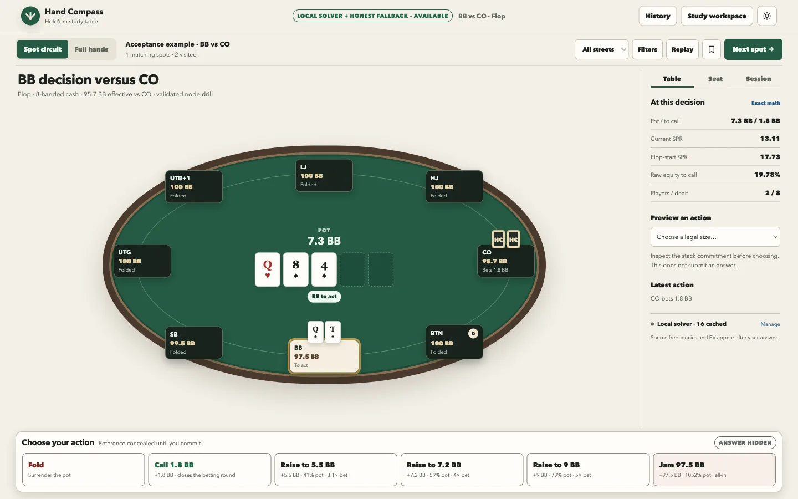
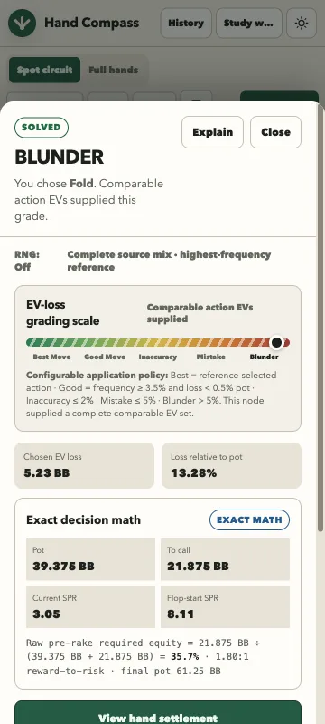
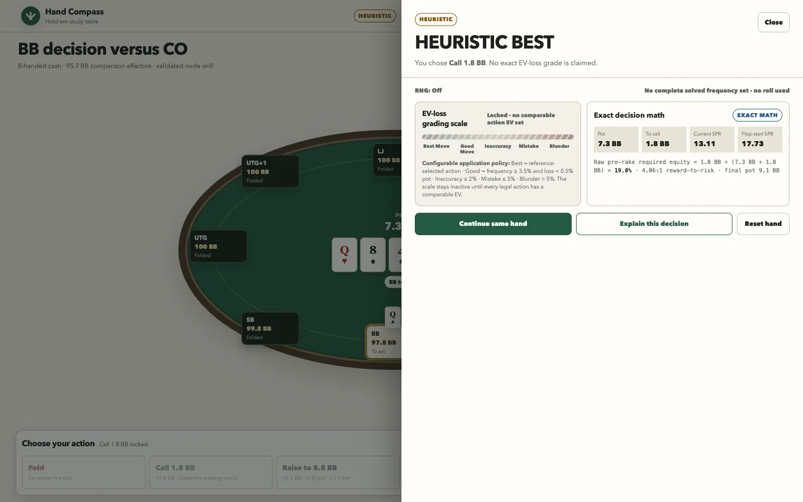

# Hand Compass

**Try it: [{{PORTFOLIO_URL}}/demos/hand-compass/]({{PORTFOLIO_URL}}/demos/hand-compass/)**
(the hosted build runs without the solver; the bundled solve and the labeled
heuristic still work)

A Texas Hold'em trainer. It deals a spot or a full hand for 4 to 8 players,
hides the answer until I commit, then grades my choice from Best Move to Blunder
with the pot-odds math and a short lesson.



## Why I built it

A lot of poker trainers present rules of thumb as if they were solved strategy.
I wanted a drill where every legal action comes from a real rules engine, and
where solved output, exact math and heuristics are labeled differently, so I
always know which one I am looking at.

## How the grading works

- **SOLVED.** When the spot is a heads-up postflop subgame, the grade comes from
  [b-inary/postflop-solver](https://github.com/b-inary/postflop-solver), run by a
  small Rust service on my machine. It returns a strategy only after the solve
  converges below 0.5% of the pot in exploitability, and every result is cached
  against the exact request, so a restart serves it again without recomputing.
- **EXACT MATH.** Pot odds, equity and sizing are computed and shown step by step.
- **HEURISTIC.** Preflop, multiway, ICM and oversized trees are refused by the
  solver and fall back to a labeled heuristic. It shows no EV loss, because there
  is no honest number to show.





## What you can do

- **Spot circuit:** 960 generated, legally replayed decisions plus an acceptance
  example. **Next spot** cycles without replacement; filter by street.
- **Full hands:** fresh cards, a rotating button, and every decision through
  settlement, with exact side pots and split pots.
- **Explore this hand:** ranges, blockers, alternative actions and next-card
  analysis after you answer.
- **Study workspace:** range inspection, precise odds, solver health and cache,
  session analytics and a validated custom spot builder.
- Keyboard: **1-9** picks a legal action, **N** deals the next spot, **E** opens
  the explanation.

## Run it

Two terminals from this folder:

```sh
npm install
npm run solver:start                              # builds and starts the local solver on 127.0.0.1:4317
npm run dev -- --host 127.0.0.1 --port 5174      # the trainer
```

Without the solver running, the bundled acceptance solve and the labeled
heuristic still work. The solver needs Rust; `npm run solver:install-toolchain`
installs a project-local toolchain. Every Cargo dependency is vendored under
`tools/local-solver/vendor/`, so the solver builds offline.

Checks:

```sh
npm test                          # 210 unit and property tests (Vitest + fast-check)
npm run build
npm run smoke:full-hands
npm run solver:smoke-curriculum   # real flop/turn/river solves, then cache reuse after a restart
```

More detail: [docs/LOCAL_SOLVER.md](docs/LOCAL_SOLVER.md) (solver scope and
limits) and [docs/strategy-pack-format.md](docs/strategy-pack-format.md).

## License

The solver adapter in `tools/local-solver/` wraps an AGPL-3.0 engine and is
licensed AGPL-3.0-or-later. See [THIRD_PARTY_NOTICES.md](THIRD_PARTY_NOTICES.md).

Joseph Blumberg · josephblumberg325@gmail.com
